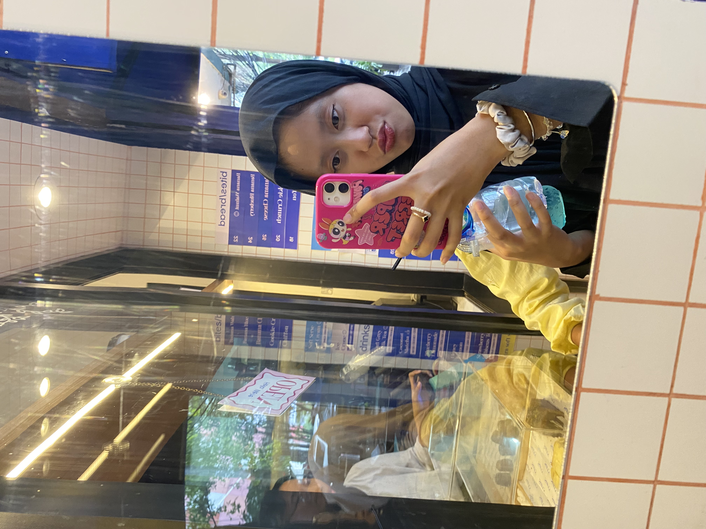

<!-- Profile Picture -->

  

<h1 align="center">🌸 Hello, I'm Queen 🌸</h1>

  🎨 Graphic Design | ✨ Decoration | 💻 IT Enthusiast

---

## 👩‍💻 About Me  
Hi! I'm **Queen**, a creative mind who loves **design**, **decoration**, and exploring the endless world of **technology**.  
I enjoy learning new IT skills, growing through creativity, and making new friends along the way 🌟.  

---

## 🌐 Connect with Me  

  

---

## ⚡ GitHub Activity  

  

  

  

---

## 👀 Profile Visitors  

  

---

## 🎉 Fun Animation  

  

